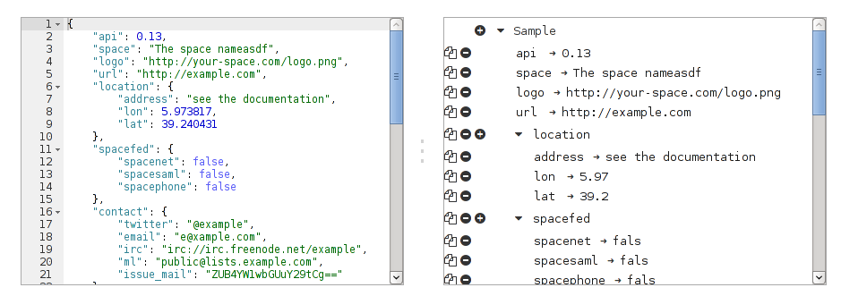

Angular JSON Editor
===================



Usage
-----

**Example 1**

Most basic example which shows a graphical tree editor to *write* a JSON by adding new elements with your mouse and edit the JSOn fields inline.

```
<div je-splitter>
    <div je-container>
        <div je-tree></div>
    </div>
</div>
```

You can customize the editor's menu by providing it a schema file from which it populates the menu items. Thus you can easily compose a JSON which is compliant to your schema. Simply change use `<div je-tree schema="schema.json"></div>`

**Example 2**

Almost most basic example. If you use two editor containers, in any order, a splitter will be dynamically added.

```
<div je-splitter>
    <div je-container>
        <div je-ace></div>
    </div>
    <div je-container>
        <div je-tree></div>
    </div>
</div>
```

**Example 3**

You can start off of a default JSON. Either provide a JavaScript object literal directly ...

```
<div je-splitter json="{string:'\u0022String example with\u0022 \'quotes\'',boolean:true,integer:42,array:[1,2,3],object:{}}">
    <div je-container>
        <div je-tree></div>
    </div>
</div>
```
... or feed the `je-splitter` directive a URL pointing to a valid JSON file.

```
<div je-splitter json="http://example.com/a-json-file.json">
    <div je-container>
        <div je-tree></div>
    </div>
</div>
```

A JavaScript object literal looks similar to JSON but they're not the same. If you use PHP you can convert your data structures with [JOL](https://github.com/slopjong/JOL).

Misc
----

Install the dependencies:

```
npm install
```

The bower packages are automatically installed.

Run the tests:

```
npm test
npm npm run test-single-run
```
It might be necessary to define an environment variable for chromium. In your `.zshrc` add the line

```
export CHROME_BIN=/usr/bin/chromium
```
